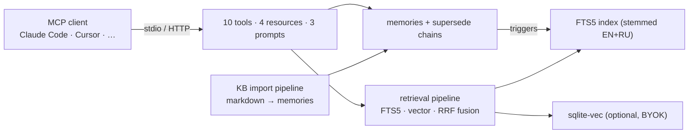

# mnemon-mcp

[](https://github.com/nikitacometa/mnemon-memory-mcp/actions/workflows/ci.yml)
[](https://www.npmjs.com/package/mnemon-mcp)
[](https://nodejs.org/)
[](LICENSE)

**Persistent layered memory for AI agents.**
Local-first. Zero-cloud. Single SQLite file.

[Landing Page](https://aisatisfy.me/mnemon/) · [npm](https://www.npmjs.com/package/mnemon-mcp) · [GitHub](https://github.com/nikitacometa/mnemon-memory-mcp)

Your AI agent forgets everything after each session. Mnemon fixes that.

It gives any [MCP](https://modelcontextprotocol.io)-compatible client — [OpenClaw](https://openclaw.ai), Claude Code, Cursor, Windsurf, or your own — a structured long-term memory backed by a single SQLite database on your machine. No API keys, no cloud, no telemetry. Just `npm install` and your agent remembers.

<p align="center">
  
</p>

---

## Why Layered Memory?

Flat key-value stores treat "what happened yesterday" the same as "never commit without tests." That's wrong — different kinds of knowledge have different lifetimes and access patterns.

Mnemon organizes memories into **four layers**:

| Layer | What it stores | How it's accessed | Lifetime |
|-------|---------------|-------------------|----------|
| **Episodic** | Events, sessions, journal entries | By date or period | Decays (30-day half-life) |
| **Semantic** | Facts, preferences, relationships | By topic or entity | Stable |
| **Procedural** | Rules, workflows, conventions | Loaded at startup | Rarely changes |
| **Resource** | Reference material, book notes | On demand | Decays slowly (90 days) |

A journal entry from last Tuesday and a coding rule that never changes live in different layers — because they should.

## Retrieval Quality

Retrieval is measured against a 50-case golden set on a real 797-memory
bilingual (RU/EN) corpus, through the actual MCP server — not a
reimplementation. Current numbers ([methodology & history](docs/EVALUATION.md)):

| Metric | FTS-only | Hybrid (FTS5 + vector, RRF) |
|--------|---------:|---------------------------:|
| Composite score | 88.9 | **91.8** |
| Recall@5 | 0.907 | **0.919** |
| MRR | 0.817 | **0.882** |
| nDCG@5 | 0.816 | **0.867** |
| Negative precision | 1.000 | 1.000 |

The eval doc also tracks the failures: score drift under corpus growth, the
BM25 field-weight bug the eval caught, and the two cases where hybrid fusion
still loses to pure lexical search. Numbers you can't audit are marketing;
[read how these are produced](docs/EVALUATION.md).

## Quick Start

### Install

```bash
npm install -g mnemon-mcp
```

Or from source:

```bash
git clone https://github.com/nikitacometa/mnemon-memory-mcp.git
cd mnemon-memory-mcp && npm install && npm run build
```

### Configure Your MCP Client

<details open>
<summary><strong>OpenClaw</strong></summary>

```bash
openclaw mcp register mnemon-mcp --command="mnemon-mcp"
```

Or add to `~/.openclaw/mcp_config.json`:

```json
{
  "mnemon-mcp": {
    "command": "mnemon-mcp"
  }
}
```

</details>

<details>
<summary><strong>Claude Code</strong></summary>

Add to `~/.claude/mcp.json`:

```json
{
  "mcpServers": {
    "mnemon-mcp": {
      "command": "mnemon-mcp"
    }
  }
}
```

</details>

<details>
<summary><strong>Cursor / Windsurf / Other MCP clients</strong></summary>

Add to your client's MCP config:

```json
{
  "mcpServers": {
    "mnemon-mcp": {
      "command": "mnemon-mcp"
    }
  }
}
```

</details>

<details>
<summary><strong>Running from source?</strong></summary>

Use the full path to the compiled entry point:

```json
{
  "mnemon-mcp": {
    "command": "node",
    "args": ["/absolute/path/to/mnemon-mcp/dist/index.js"]
  }
}
```

</details>

### Verify

```bash
echo '{"jsonrpc":"2.0","method":"tools/list","id":1}' | mnemon-mcp
```

You should see 10 tools in the response. The database (`~/.mnemon-mcp/memory.db`) is created automatically on first run.

That's it. Your agent now has persistent memory.

## What It Can Do

### 10 MCP Tools

| Tool | What it does |
|------|-------------|
| **`memory_add`** | Store a memory with layer, entity, confidence, importance, and optional TTL |
| **`memory_search`** | Full-text or exact search with filters by layer, entity, date, scope, confidence |
| **`memory_update`** | Update in-place or create a versioned replacement (superseding chain) |
| **`memory_delete`** | Delete a memory; re-activates its predecessor if any |
| **`memory_inspect`** | Get layer statistics or trace a single memory's version history |
| **`memory_export`** | Export to JSON, Markdown, or Claude-md format with filters |
| **`memory_health`** | Run diagnostics: expired entries, orphaned chains, stale memories; optionally GC |
| **`memory_session_start`** | Start an agent session — returns session ID for grouping memories |
| **`memory_session_end`** | End a session with optional summary; returns duration and memory count |
| **`memory_session_list`** | List sessions with filters by client, project, or active status |

### MCP Resources & Prompts

**Resources** — live data your agent can read:

| URI | Returns |
|-----|---------|
| `memory://stats` | Aggregate stats per layer |
| `memory://recent` | Memories created/updated in last 24h |
| `memory://layer/{layer}` | All active memories in a layer |
| `memory://entity/{name}` | All active memories about an entity |

**Prompts** — pre-built workflows:

| Prompt | Purpose |
|--------|---------|
| `recall` | "Tell me everything you know about X" |
| `context-load` | Load relevant context before starting a task |
| `journal` | Create a structured journal entry |

## Search

Four modes, all supporting layer / entity / scope / date / confidence filters:

**FTS mode** (default without embeddings) — tokenized full-text search with BM25 ranking. Multi-word queries use AND; if too few results, OR supplements with a score penalty. Progressive AND relaxation tries top-3 most specific terms before falling back to full OR.

**Hybrid mode** (default when embeddings configured) — combines FTS5 + vector search via [Reciprocal Rank Fusion](https://www.singlestore.com/blog/hybrid-search-using-reciprocal-rank-fusion-in-sql/). Detects quoted entities in queries (e.g., `'Essentialism'`) and runs weighted sub-queries for cross-reference retrieval.

**Vector mode** — pure cosine similarity search over embeddings.

**Exact mode** — `LIKE` substring match for precise phrase lookups.

Scores: `bm25 × (0.3 + 0.7 × importance) × decay(layer) × recency`

Recency boost: `1 / (1 + daysSince / 365)` — gently rewards recently created memories without penalizing old ones.

### Architecture



The full picture — module boundaries, write/read paths, invariants, known
limitations — is in [docs/ARCHITECTURE.md](docs/ARCHITECTURE.md). Design
decisions are recorded as ADRs: [SQLite+FTS5 core](docs/adr/0001-sqlite-fts5-over-vector-db.md),
[hybrid RRF retrieval](docs/adr/0002-hybrid-retrieval-rrf.md),
[synchronous driver](docs/adr/0003-synchronous-better-sqlite3.md),
[layered memory model](docs/adr/0004-layered-memory-model.md).

### Stemming

Snowball stemmer applied at both **index time** and **query time** for English and Russian. This means `"running"` matches `"runs"`, and `"книги"` matches `"книга"`. Stop words are filtered from queries to improve precision.

## Fact Versioning

Knowledge evolves. Mnemon doesn't delete old facts — it chains them:

```
v1: "Team uses React 17"  →  superseded_by: v2
v2: "Team uses React 19"  →  supersedes: v1 (active)
```

Search returns only the latest version. `memory_inspect` with `include_history: true` reveals the full chain. `memory_delete` re-activates the predecessor — nothing is lost.

## Vector Search (Optional, BYOK)

Enable semantic similarity search by providing your own embedding API:

```bash
# OpenAI
MNEMON_EMBEDDING_PROVIDER=openai MNEMON_EMBEDDING_API_KEY=sk-... mnemon-mcp

# Ollama (local, free)
MNEMON_EMBEDDING_PROVIDER=ollama mnemon-mcp
```

This unlocks two additional search modes:
- **`mode: "vector"`** — pure cosine similarity search
- **`mode: "hybrid"`** — FTS5 + vector combined via [Reciprocal Rank Fusion](https://www.singlestore.com/blog/hybrid-search-using-reciprocal-rank-fusion-in-sql/)

Requires `sqlite-vec` (installed as optional dependency). New memories are embedded on add; existing ones can be backfilled.

<details>
<summary>Embedding configuration</summary>

| Variable | Default | Description |
|----------|---------|-------------|
| `MNEMON_EMBEDDING_PROVIDER` | — | `openai` or `ollama` (unset = disabled) |
| `MNEMON_EMBEDDING_API_KEY` | — | API key (required for OpenAI) |
| `MNEMON_EMBEDDING_MODEL` | `text-embedding-3-small` / `nomic-embed-text` | Model name |
| `MNEMON_EMBEDDING_DIMENSIONS` | `1024` / `768` | Vector dimensions |
| `MNEMON_OLLAMA_URL` | `http://localhost:11434` | Ollama endpoint |

</details>

## Importing a Knowledge Base

Got a folder of Markdown files? Import them in bulk:

```bash
cp config.example.json ~/.mnemon-mcp/config.json   # edit this first
npm run import:kb -- --kb-path /path/to/your/kb     # incremental (skips unchanged files)
```

The config maps glob patterns to memory layers:

```json
{
  "owner_name": "your-name",
  "extra_stop_words": [],
  "mappings": [
    {
      "glob": "journal/*.md",
      "layer": "episodic",
      "entity_type": "user",
      "entity_name": "$owner",
      "importance": 0.6,
      "split": "h2"
    },
    {
      "glob": "people/*.md",
      "layer": "semantic",
      "entity_type": "person",
      "entity_name": "from-heading",
      "importance": 0.8,
      "split": "h3"
    }
  ]
}
```

### Config Fields

| Field | Type | Description |
|-------|------|-------------|
| `owner_name` | string | Your name — used for `$owner` substitution in `entity_name` |
| `extra_stop_words` | string[] | Words to filter from FTS queries (e.g., your name forms) |
| `glob` | string | File pattern to match |
| `layer` | string | Target memory layer |
| `entity_type` | string | `user` / `person` / `project` / `concept` / `file` / `rule` / `tool` |
| `entity_name` | string | Literal name, `"$owner"`, or `"from-heading"` (extract from H2/H3) |
| `split` | string | `"whole"` (one memory per file), `"h2"`, or `"h3"` (split on headings) |
| `importance` | number | 0.0–1.0, affects search ranking |
| `confidence` | number | 0.0–1.0, filterable in search |
| `scope` | string | Optional namespace |

## HTTP Transport

For remote or multi-client setups:

```bash
MNEMON_AUTH_TOKEN=your-secret MNEMON_HOST=0.0.0.0 MNEMON_PORT=3000 npm run start:http
```

| Endpoint | Description |
|----------|-------------|
| `POST /mcp` | MCP JSON-RPC (Bearer auth if token set) |
| `GET /health` | `{"status":"ok","version":"..."}` |

Binds to `127.0.0.1` by default. Binding to any other host requires `MNEMON_AUTH_TOKEN` — the server refuses to expose the memory store to the network unauthenticated (override with `MNEMON_ALLOW_INSECURE_HTTP=1` on a trusted network). Rate limiting (100 req/min/IP by default), opt-in CORS, 1MB body limit, timing-safe auth, graceful shutdown on SIGTERM.

## Configuration Reference

| Variable | Default | Description |
|----------|---------|-------------|
| `MNEMON_DB_PATH` | `~/.mnemon-mcp/memory.db` | Database path |
| `MNEMON_KB_PATH` | `.` | Knowledge base root for import |
| `MNEMON_CONFIG_PATH` | `~/.mnemon-mcp/config.json` | Import config path |
| `MNEMON_AUTH_TOKEN` | — | Bearer token for HTTP transport |
| `MNEMON_HOST` | `127.0.0.1` | HTTP transport bind address |
| `MNEMON_PORT` | `3000` | HTTP transport port |
| `MNEMON_CORS_ORIGIN` | — | CORS `Access-Control-Allow-Origin` (no CORS headers unless set) |
| `MNEMON_RATE_LIMIT` | `100` | Max requests per minute per IP (0 = off) |

## Tool Reference

<details>
<summary><code>memory_add</code> — full parameter list</summary>

| Parameter | Type | Required | Description |
|-----------|------|----------|-------------|
| `content` | string | Yes | Memory text (max 100K chars) |
| `layer` | string | Yes | `episodic` / `semantic` / `procedural` / `resource` |
| `title` | string | No | Short title (max 500 chars) |
| `entity_type` | string | No | `user` / `project` / `person` / `concept` / `file` / `rule` / `tool` |
| `entity_name` | string | No | Entity name for filtering |
| `confidence` | number | No | 0.0–1.0 (default 0.8) |
| `importance` | number | No | 0.0–1.0 (default 0.5) |
| `scope` | string | No | Namespace (default `global`) |
| `source_file` | string | No | Source file path — triggers auto-supersede of matching entries |
| `ttl_days` | number | No | Auto-expire after N days |
| `valid_from` / `valid_until` | string | No | Temporal fact window (ISO 8601) |

</details>

<details>
<summary><code>memory_search</code> — full parameter list</summary>

| Parameter | Type | Required | Description |
|-----------|------|----------|-------------|
| `query` | string | Yes | Search text |
| `mode` | string | No | `fts` (default), `exact`, `vector`, `hybrid` |
| `layers` | string[] | No | Filter by layers |
| `entity_name` | string | No | Filter by entity (supports aliases) |
| `scope` | string | No | Filter by scope |
| `date_from` / `date_to` | string | No | Date range (ISO 8601) |
| `as_of` | string | No | Temporal fact filter — facts valid at this date |
| `min_confidence` | number | No | Minimum confidence |
| `min_importance` | number | No | Minimum importance |
| `limit` | number | No | Max results (default 10, max 100) |
| `offset` | number | No | Pagination offset |

</details>

<details>
<summary><code>memory_update</code> — full parameter list</summary>

| Parameter | Type | Required | Description |
|-----------|------|----------|-------------|
| `id` | string | Yes | Memory ID |
| `content` | string | No | New content |
| `title` | string | No | New title |
| `confidence` | number | No | New confidence |
| `importance` | number | No | New importance |
| `supersede` | boolean | No | `true` = versioned replacement; `false` (default) = in-place |
| `new_content` | string | No | Content for superseding entry |

</details>

<details>
<summary><code>memory_delete</code></summary>

| Parameter | Type | Required | Description |
|-----------|------|----------|-------------|
| `id` | string | Yes | Memory ID. Re-activates predecessor if part of a superseding chain |

</details>

<details>
<summary><code>memory_inspect</code></summary>

| Parameter | Type | Required | Description |
|-----------|------|----------|-------------|
| `id` | string | No | Memory ID (omit for aggregate stats) |
| `layer` | string | No | Filter stats by layer |
| `entity_name` | string | No | Filter stats by entity |
| `include_history` | boolean | No | Show superseding chain |

</details>

<details>
<summary><code>memory_export</code></summary>

| Parameter | Type | Required | Description |
|-----------|------|----------|-------------|
| `format` | string | Yes | `json` / `markdown` / `claude-md` |
| `layers` | string[] | No | Filter by layers |
| `scope` | string | No | Filter by scope |
| `date_from` / `date_to` | string | No | Date range |
| `limit` | number | No | Max entries (default all, max 10K) |

</details>

<details>
<summary><code>memory_health</code></summary>

| Parameter | Type | Required | Description |
|-----------|------|----------|-------------|
| `cleanup` | boolean | No | `true` = garbage-collect expired entries (default: report only) |

Returns: status (`healthy` / `warning` / `degraded`), per-layer stats, expired entries, orphaned chains, stale/low-confidence counts, cleaned count when `cleanup=true`.

</details>

<details>
<summary><code>memory_session_start</code></summary>

| Parameter | Type | Required | Description |
|-----------|------|----------|-------------|
| `client` | string | Yes | Client identifier (e.g. `claude-code`, `cursor`, `api`) |
| `project` | string | No | Project scope for this session |
| `meta` | object | No | Additional session metadata |

Returns: `id` (session UUID), `started_at` (ISO 8601).

</details>

<details>
<summary><code>memory_session_end</code></summary>

| Parameter | Type | Required | Description |
|-----------|------|----------|-------------|
| `id` | string | Yes | Session ID to end |
| `summary` | string | No | Summary of what was accomplished (max 10K chars) |

Returns: `id`, `ended_at`, `duration_minutes`, `memories_count`.

</details>

<details>
<summary><code>memory_session_list</code></summary>

| Parameter | Type | Required | Description |
|-----------|------|----------|-------------|
| `limit` | number | No | Max sessions (default 20, max 100) |
| `client` | string | No | Filter by client |
| `project` | string | No | Filter by project |
| `active_only` | boolean | No | Only return sessions that haven't ended (default false) |

Returns: array of sessions with `id`, `client`, `project`, `started_at`, `ended_at`, `summary`, `memories_count`.

</details>

## How It Compares

| | **mnemon-mcp** | mem0 | basic-memory | Engram | Anthropic KG |
|---|---|---|---|---|---|
| **Architecture** | SQLite FTS5 + vector | Cloud API + Qdrant | Markdown + vector | SQLite FTS5 | JSON file |
| **Memory structure** | 4 typed layers | Flat | Flat | Flat + sessions | Graph |
| **Search** | FTS5 + hybrid RRF | Semantic | Hybrid | FTS5 | Exact |
| **Fact versioning** | Superseding chains | Partial | No | No | No |
| **Stemming** | EN + RU (Snowball) | EN only | EN only | None | None |
| **Embeddings** | BYOK (OpenAI / Ollama) | Built-in | FastEmbed | None | None |
| **Dependencies** | 0 required | Qdrant, Neo4j | Python 3.12 | Go binary | None |
| **Cloud required** | No | Yes | No | No | No |
| **Cost** | Free | $19–249/mo | Free | Free | Free |
| **Setup** | `npm install -g` | Docker + API keys | pip + deps | Go install | Built-in |
| **License** | MIT | Apache 2.0 | AGPL | MIT | MIT |

Extended competitive analysis with sources: [docs/COMPETITORS.md](docs/COMPETITORS.md).

## Development

```bash
npm run dev        # run via tsx (no build step)
npm run build      # TypeScript → dist/
npm test           # vitest (272 tests: unit + integration + MCP dispatch + HTTP transport + hybrid RRF)
npm run bench      # performance benchmarks
npm run db:backup  # backup database
```

**Stack:** TypeScript 5.9 (strict mode), better-sqlite3, @modelcontextprotocol/sdk, Snowball stemmer, Zod, vitest.

See [CONTRIBUTING.md](CONTRIBUTING.md) for code guidelines.

## Design Principles

- **Air-gapped** — zero network calls, zero telemetry. Your memories stay on your machine.
- **Single file** — one SQLite database, zero ops, instant backup via file copy.
- **Deterministic search** — FTS5, not embeddings, is the default. Interpretable, reproducible, no GPU needed.
- **Structured over flat** — layers encode access patterns; superseding chains encode time.
- **Minimal** — 4 production dependencies. Works everywhere Node runs.

## License

[MIT](LICENSE)
