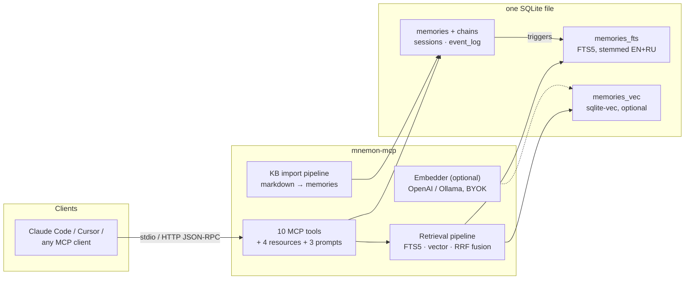

# Architecture

How mnemon-mcp is put together, and why. Decision rationale lives in the
[ADR series](adr/); retrieval quality numbers in [EVALUATION.md](EVALUATION.md).

## System overview



Everything lives in one SQLite file (`~/.mnemon-mcp/memory.db`, WAL mode,
foreign keys ON, `0700`/`0600` permissions). Backup is a file copy.

## Module map

```
src/
  index.ts          stdio entry — MCP server over stdin/stdout
  index-http.ts     HTTP entry — Bearer auth, rate limiting, loopback default
  server.ts         MCP wiring: tools/resources/prompts dispatch, embed-on-write
  db.ts             schema, versioned migrations, FTS5 triggers, indexes
  validation.ts     Zod schemas — single source of truth for runtime validation
                    AND the JSON Schemas advertised to MCP clients
  types.ts          TypeScript mirror of the SQLite schema
  tools/            one file per MCP tool (add/search/update/delete/…)
  stemmer.ts        Snowball EN+RU, index-time and query-time
  stop-words.ts     bilingual stop word filtering
  date-extractor.ts natural-language date parsing (RU) → SQL date filters
  vector.ts         sqlite-vec loading, vec table lifecycle
  embedder.ts       Embedder interface + OpenAI/Ollama implementations
  import/           KB import pipeline: glob routing, frontmatter, splitting,
                    hash-based incremental re-import
```

Dependency direction: `tools/` depend on `db`/`validation`/`types`, never on
transports. Transports (`index.ts`, `index-http.ts`) compose everything at
the edge. `validation.ts` is deliberately the only place where input shapes
are defined — `z.toJSONSchema()` generates the MCP tool schemas from the same
objects that validate at runtime, so docs and enforcement cannot drift.

## Write path

`memory_add` runs inside a single transaction:

1. Validate input (Zod, length caps on every string field).
2. If `source_file` matches an existing active memory — auto-supersede it
   (the new row links `supersedes`, the old row gets `superseded_by`).
3. Contradiction check: FTS query over the same entity; potential conflicts
   are returned to the agent, which decides whether to supersede.
4. Insert memory + `event_log` row; FTS5 triggers index the stemmed text.
5. Outside the transaction, best-effort: embed the text and upsert the
   vector. Embedding failure never fails the write — the memory simply stays
   FTS-only until backfill.

**Supersede chains** are the versioning invariant: search sees only chain
heads (partial indexes on `superseded_by IS NULL`), `memory_inspect` walks
history, `memory_delete` re-links neighbors, and expired-entry cleanup
resolves *surviving* neighbors before rewiring — adjacent links can expire
together without breaking the chain.

## Read path (retrieval pipeline)

A `memory_search` call resolves in stages:

1. **Date extraction** — natural-language dates in the query ("в марте
   2025") become SQL range filters and are stripped from the FTS text. A
   query that is *only* dates routes to pure date-range search.
2. **Mode selection** — explicit `mode`, else hybrid when an embedder +
   sqlite-vec are present, else FTS.
3. **FTS leg** — stemmed, stop-word-filtered query; AND first, progressive
   relaxation to the top-2 most specific stems, then OR with a score
   penalty. BM25 with field weights title=3 / content=1 / entity=2.
4. **Vector leg** (hybrid/vector) — query embedding → KNN over sqlite-vec.
5. **Fusion** — weighted RRF (k=60), adaptive FTS weight, quoted-entity
   sub-queries at 3× weight (ADR-0002).
6. **Deterministic re-ranking** — `score = bm25_norm × (0.3 + 0.7·importance)
   × decay(layer) × recency`, where decay applies a 30-day half-life to
   episodic and 90-day to resource layers.
7. **Filters** at every stage: layer, entity (alias-resolved), scope, dates,
   confidence/importance floors, `as_of` temporal validity.

Every search is logged to `search_log` (query, resolved mode, result count,
latency) — retrieval observability comes built in.

## Import pipeline

`npm run import:kb` walks a markdown knowledge base with a user-owned config
(glob → layer/entity/split routing):

- Files split by H2/H3 into section-level memories with per-section date
  extraction (filenames, headings).
- Incremental by content hash — only the **latest** import per file counts,
  so reverting a file re-imports it.
- Frontmatter can override layer and entity per file.

## Transports

- **stdio** (default): one process per client, synchronous better-sqlite3
  (ADR-0003), zero network exposure. Nothing is ever written to stdout
  except JSON-RPC.
- **HTTP** (`start:http`): binds `127.0.0.1` by default; refuses non-loopback
  binds without a Bearer token; timing-safe token comparison; per-IP token
  bucket rate limiting; opt-in CORS; 1 MB body cap; graceful shutdown.

## Performance notes

- Partial indexes keep every hot query scoped to active memories.
- FTS5 sync triggers carry `WHEN` guards so access-count bumps on search hits
  do not trigger re-indexing.
- Migrations are idempotent (`PRAGMA user_version` + safe column helpers) —
  a partially applied migration can re-run safely.

Measured by `npm run bench` (vitest bench, 500-row mixed RU/EN corpus,
Apple Silicon; mean per operation):

| Operation | Mean |
|-----------|-----:|
| `memory_add` (semantic) | 0.45 ms |
| FTS AND, 2 terms | 2.5 ms |
| FTS AND, 2 terms + layer filter | 0.36 ms |
| FTS AND → OR fallback, 4 terms | 0.39 ms |
| Exact substring | 0.16 ms |
| FTS + open-ended date filter | 8.5 ms |
| Export 500 entries as JSON | 4.1 ms |

The layer-filtered query is ~7× *faster* than the unfiltered one: the partial
index narrows the candidate set before ranking. The open-ended date filter is
the slowest path — `date(COALESCE(event_at, created_at))` is not indexable, so
it scans. Both are worth knowing before optimizing the wrong thing.

## Known limitations

Tracked honestly rather than hidden; several have open backlog entries:

1. **Import reconciliation** — duplicate headings within one file collide;
   sections removed from a file stay active until superseded by other means.
2. **Single-writer assumption** — chain rewiring invariants are transaction-
   safe within a process, not defended across concurrent writer processes
   (ADR-0003).
3. **Hybrid soft regressions** — 2 golden-set cases where vector noise
   dilutes a strong lexical match through RRF (EVALUATION.md).
4. **Deletion is not a secure erase** — `event_log` retains prior content by
   design (audit trail); see SECURITY.md.

### Vector candidate pool — why KNN widens

sqlite-vec's `vec0` KNN takes `k` and returns the k globally nearest rows;
it cannot filter on columns joined from `memories`. So filters
(layer/entity/scope/dates/confidence) apply *after* the scan, and a fixed `k`
silently loses matches that sit outside the global top-k — a scoped query over
a large corpus could return nothing while matching memories existed.

`vectorSearch` therefore widens the pool (`k = limit×3`, ×4 per round, capped
at `min(vecCount, 2000)`) until enough survivors are found or the index is
exhausted. Exhaustion is decided by the cap alone, deliberately: `knnSearch`
drops superseded rows *after* `vec0` applies `k`, so a short result set means
"the neighbors were superseded", not "the index is spent" — treating it as
exhaustion reintroduced the false negatives on exactly this project's headline
feature. The query is embedded once, before the loop.

### Embedding index lifecycle

`vector_index_meta` (migration v8) pins the provider/model/dimensions that
populated the vector index. Vectors from two embedding spaces in one index
make cosine distance meaningless *with no error to show for it*, so a
mismatch marks vector search unavailable with a reason and leaves FTS serving.
An empty index adopts the new space instead (nothing to corrupt), and a
dimension change rebuilds the table. Databases predating the metadata table
recover provenance from the per-row `embedding_model` tags rather than
trusting the current config — otherwise a model switch made during an upgrade
would be silently blessed.
